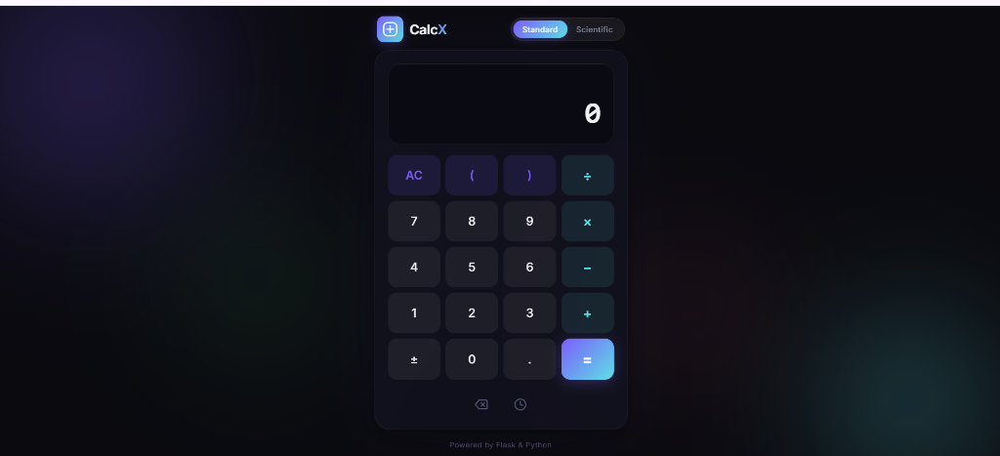
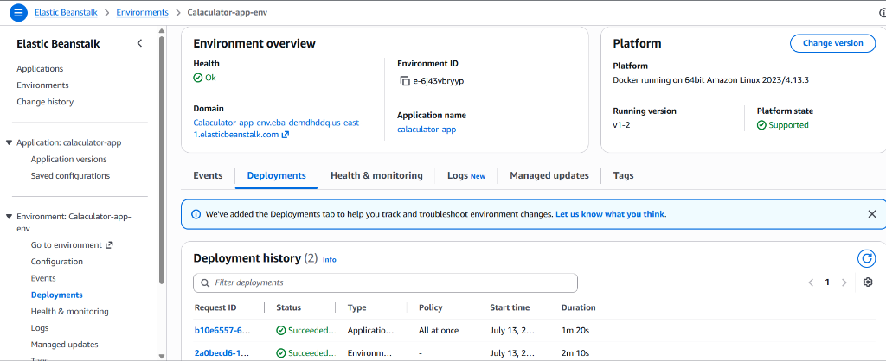
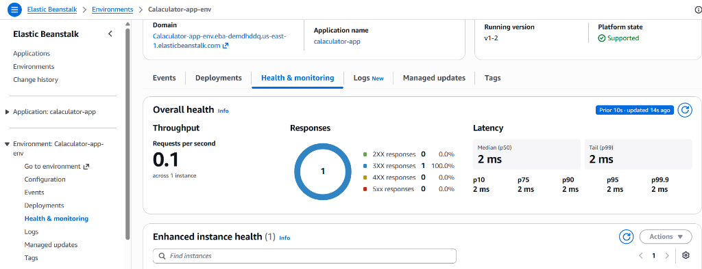
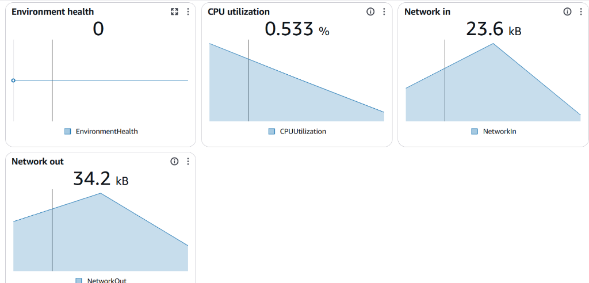

# CalcX — Modern Calculator on AWS Elastic Beanstalk

A modern, glassmorphism-styled calculator web application built with **Flask (Python)** backend and **HTML/CSS/JavaScript** frontend, containerized with **Docker** and deployed on **AWS Elastic Beanstalk**.

---

## Application Preview



---

## Architecture

| Layer | Technology |
|-------|-----------|
| **Frontend** | HTML5, CSS3, JavaScript |
| **Backend** | Flask (Python) |
| **Containerization** | Docker |
| **Deployment** | AWS Elastic Beanstalk |
| **Platform** | Docker on 64bit Amazon Linux 2023/4.13.3 |

---

## Features

- **Modern Dark UI** — Glassmorphism design with animated gradient orbs
- **Standard Mode** — Basic arithmetic operations (+, −, ×, ÷)
- **Scientific Mode** — sin, cos, tan, log, ln, √, x², x³, x!, π, e, and more
- **Keyboard Support** — Full keyboard shortcuts for quick calculations
- **History Panel** — Track and restore past calculations
- **Ripple Effects** — Premium micro-animations on every interaction
- **Responsive** — Works seamlessly on desktop and mobile
- **Dockerized** — Consistent deployment across environments

---

## AWS Elastic Beanstalk Deployment

### Environment Overview & Deployments



### Health & Monitoring



### CloudWatch Metrics



---

## Project Structure

```
├── app.py                  # Flask backend (API + routes)
├── requirements.txt        # Python dependencies
├── Dockerfile              # Docker container configuration
├── .dockerignore           # Docker ignore rules
├── templates/
│   └── index.html          # Main HTML page
├── static/
│   ├── css/
│   │   └── style.css       # Glassmorphism dark theme
│   └── js/
│       └── script.js       # Calculator logic + API calls
└── screenshots/            # Documentation images
```

---

## Getting Started

### Prerequisites

- Python 3.11+
- Docker (optional, for containerized deployment)
- AWS CLI & EB CLI (for AWS deployment)

### Run Locally

```bash
# Clone the repository
git clone https://github.com/450gowsik/AWS-Elastic-Beanstalk.git
cd AWS-Elastic-Beanstalk

# Install dependencies
pip install -r requirements.txt

# Start the application
python app.py
```

Visit `http://localhost:5000` in your browser.

### Run with Docker

```bash
# Build the Docker image
docker build -t calcx-calculator .

# Run the container
docker run -p 5000:5000 calcx-calculator
```

### Deploy to AWS Elastic Beanstalk

```bash
# Initialize Elastic Beanstalk
eb init -p docker calcx-calculator

# Create environment and deploy
eb create calcx-env

# Open in browser
eb open
```

---

## API Endpoints

| Method | Endpoint | Description |
|--------|----------|-------------|
| `GET` | `/` | Serves the calculator UI |
| `POST` | `/api/calculate` | Evaluates math expressions |

### Example API Request

```json
POST /api/calculate
{
  "expression": "7+3"
}

// Response
{
  "success": true,
  "result": "10"
}
```

### Scientific Operations

```json
POST /api/calculate
{
  "operation": "sin",
  "value": 90
}

// Response
{
  "success": true,
  "result": "1.0"
}
```

---

## Tech Stack

- **Flask** — Lightweight Python web framework
- **Gunicorn** — Production WSGI server
- **Docker** — Containerization
- **AWS Elastic Beanstalk** — PaaS deployment
- **HTML/CSS/JS** — Frontend with modern glassmorphism design

---

## License

This project is open source and available under the [MIT License](LICENSE).

---

<p align="center">
  <b>Built with Flask & Python | Deployed on AWS Elastic Beanstalk</b>
</p>
